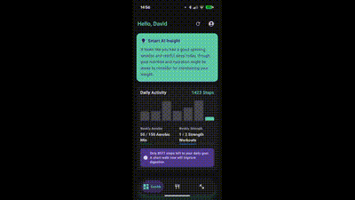

# MyHealthTracker

**AI-Powered Health & Nutrition Tracker — Native Android App**

A modern Android health & wellness app that combines automated fitness tracking with multimodal AI nutrition analysis, built end-to-end with Kotlin, Jetpack Compose, and Google Gemini AI.


---

## The Problem

Manual food-diary logging is tedious and has high drop-off rates. Most nutrition apps require typing every ingredient and looking up macros by hand. MyHealthTracker removes that friction by letting users log a meal with a single photo, using multimodal AI to do the nutritional analysis automatically.

## Key Features

- **📸 AI Meal Logging** — Snap a photo (or type a description) of a meal; Google Gemini AI analyzes it via a secure Cloud Functions backend and returns estimated macros (calories, protein, carbs, fat).
- **💤 Automated Health Sync** — Sleep and activity data sync seamlessly through Google Health Connect — no manual entry.
- **🧠 Personalized AI Insights** — Daily, personalized recommendations generated from the user's logged data, with a clear "general guidance, not medical advice" framing.
- **📶 Offline-First** — Full functionality without connectivity via Firestore's offline persistence, syncing automatically when back online.
- **🎨 Modern UI** — Built entirely in Jetpack Compose (Material 3), with full Dark/Light mode and RTL layout support.

## Architecture

```
┌─────────────────────┐         ┌──────────────────────┐
│   Android Client     │         │   Firebase Backend    │
│  (Kotlin + Compose)  │◄───────►│                        │
│                      │         │  • Cloud Functions    │
│  • Health Connect    │  HTTPS  │    (Gemini AI calls)  │
│  • Firestore (local) │◄───────►│  • Firestore          │
│  • Offline cache     │         │  • Auth                │
└─────────────────────┘         └──────────────────────┘
```

**Key design decisions:**
- All AI API calls run server-side (Cloud Functions) — API keys never touch the client.
- Meal photos are analyzed but not stored — only the extracted nutritional data is persisted, minimizing data sensitivity.
- Body metrics are for self-tracking only and are never sent to the AI model.

## Tech Stack

| Layer | Technology |
|---|---|
| Language | Kotlin |
| UI | Jetpack Compose, Material 3 |
| Backend | Firebase Cloud Functions |
| Database | Cloud Firestore (offline-first sync) |
| AI | Google Gemini API (multimodal — image + text) |
| Health Data | Android Health Connect API |
| Auth | Firebase Authentication |

## Screenshots



## Development Process

This project was built using an AI-assisted, spec-driven development workflow — detailed planning documents and phased implementation prompts are available in [`docs/`](./docs) and [`prompts/`](./prompts) for anyone curious about the process.

## Status

Actively in development. Core tracking, AI meal logging, and insights generation are implemented; UI polish and additional features are ongoing.

---

*Built by [Your Name] — [portfolio/contact link]*
